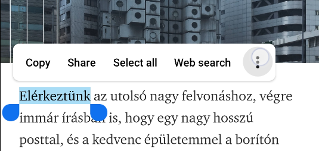
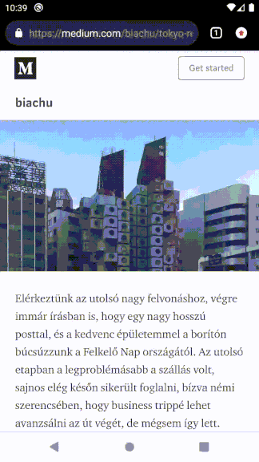
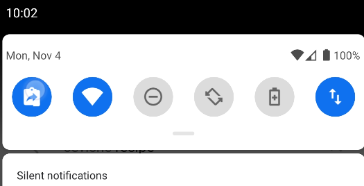

# Welcome Android 10 - Please read!

With Android 10 Google introduced some privacy changes that disable **to read** and **monitor** the system clipboard in the background.

Privacy-wise this is a good thing, but unfortunately Google did not add any alternative, so ClipboardActions can not work as it used to. 
If you dislike that please visit and star the official [Android issue](https://issuetracker.google.com/issues/123461156)!

## New Behaviour - Long-press Context

In many texts you can long press select a text and then use the 3 dots menu to select the **Copy + Save** action. It copies your word to the clipboard and also saves it to Clipboard Actions.

## New Behaviour - Quick Settings copy action

Dragging down the status bar reveals the Quick Settings. Pressing the Clipboard Actions - **Save Clipboard** quick setting, Clipboard Actions can access the current clipboard one time and saves it to the database. This is the most universal way to use ClipboardActions in Android 10, because it also works with Whatsapp and many other applications where the three dots menu is not available.

This shows how to setup the action. Drag down the status bar and full expand the quick settings, press the edit icon. Then drag the Clipboard Actions quick setting from the very bottom to the top. 
